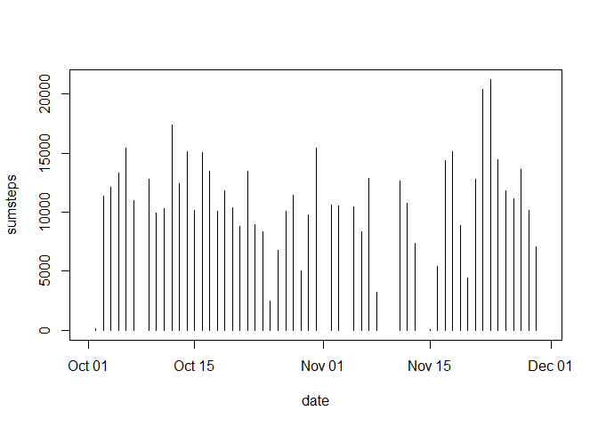
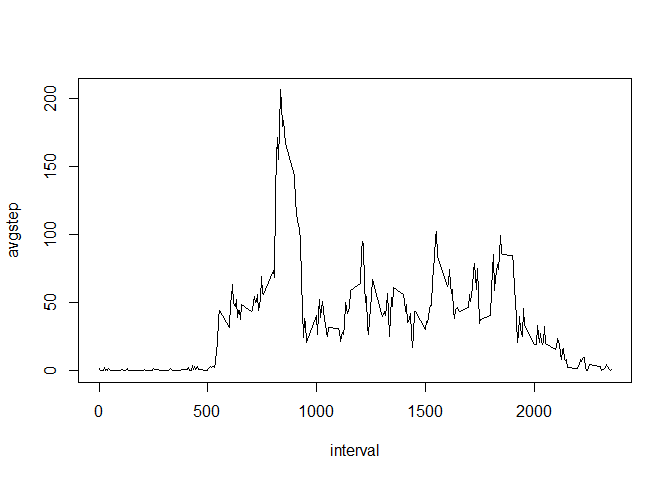
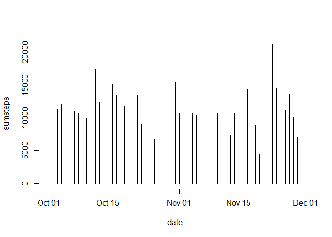
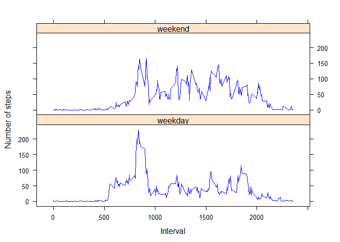

# Reproducible Research: Peer Assessment 1


## Loading and preprocessing the data


```r
library(dplyr)
```

```
## 
## Attaching package: 'dplyr'
```

```
## The following objects are masked from 'package:stats':
## 
##     filter, lag
```

```
## The following objects are masked from 'package:base':
## 
##     intersect, setdiff, setequal, union
```

```r
library(lattice)

activity<-read.csv("activity.csv")

activity<-mutate(activity,date=as.Date(date,"%Y-%m-%d"))
groupbydate<-group_by(activity,date)
```

## What is mean total number of steps taken per day?

```r
# Calculate the total steps taken per day
stepsperday<-summarize(groupbydate,sumsteps=sum(steps))

# Plot the steps taken per day
with(stepsperday,plot(date,sumsteps,type="h"))
```



```r
# Calculate the mean number of steps taken per day
meansteps1<-mean(stepsperday$sumsteps,na.rm=TRUE)

# Calculate the median number of steps taken per day
mediansteps1<-median(stepsperday$sumsteps,na.rm=TRUE)
```

The mean number of steps taken per day is 1.0766189\times 10^{4}
The median number of steps taken per day is 10765

## What is the average daily activity pattern?


```r
# Calculate the average daily activity pattern
groupbyinterval<-group_by(activity,interval)

avgdailyactivity<-summarize(groupbyinterval,avgstep=mean(steps,na.rm=TRUE))

# Line plot of the average daily activity pattern
with(avgdailyactivity,plot(interval,avgstep,type="l"))
```



```r
# Find the interval with the highest average activity
highestactivityinterval<-avgdailyactivity[which.max(avgdailyactivity$avgstep),]
```

The interval with the highest average activity is 835 with average number of steps 206.1698113

## Imputing missing values

The strategy I choose to impute the missing values is to replace the NAs with the mean for that 5-minute interval across all days. The resulting dataset with the missing values replaced by imputed values is called 'imputed activity'


```r
# Calculate and report the total number of missing values in the dataset

totalna<-sum(is.na(activity$steps))

# The strategy I choose to impute the missing values is to replace the NAs with the mean for that 5-minute interval

imputedactivity<-activity
for (i in 1:nrow(imputedactivity)) {
        if (is.na(imputedactivity[i,"steps"])) {
                imputedactivity[i,"steps"]<-avgdailyactivity[avgdailyactivity$interval==imputedactivity[i,"interval"],"avgstep"]
                
        } 
}

groupbydateimputed<-group_by(imputedactivity,date)

# Calculate the total steps taken per day
imputedstepsperday<-summarize(groupbydateimputed,sumsteps=sum(steps))
imputedstepsperday
```

```
## Source: local data frame [61 x 2]
## 
##          date sumsteps
##        (date)    (dbl)
## 1  2012-10-01 10766.19
## 2  2012-10-02   126.00
## 3  2012-10-03 11352.00
## 4  2012-10-04 12116.00
## 5  2012-10-05 13294.00
## 6  2012-10-06 15420.00
## 7  2012-10-07 11015.00
## 8  2012-10-08 10766.19
## 9  2012-10-09 12811.00
## 10 2012-10-10  9900.00
## ..        ...      ...
```

```r
# Plot the steps taken per day
with(imputedstepsperday,plot(date,sumsteps,type="h"))
```



```r
# Calculate the mean number of steps taken per day
meansteps2<-mean(imputedstepsperday$sumsteps,na.rm=TRUE)

# Calculate the median number of steps taken per day
mediansteps2<-median(imputedstepsperday$sumsteps,na.rm=TRUE)
```

Initial mean steps per day (no imputed values): 1.0766189\times 10^{4}
Revised mean steps per day (imputed values added): 1.0766189\times 10^{4}

Initial median steps per day (no imputed values): 10765
Revised median steps per day (imputed values added): 1.0766189\times 10^{4}

The effect of imputing the missing values has resulted in the mean steps per day remaining the same and the median steps per day only increasing slightly from 10765 to 10766.19. The mean and median steps per day for the dataset set with imputed values are both the same


## Are there differences in activity patterns between weekdays and weekends?

```r
daylabeled<-mutate(imputedactivity,daylabel=weekdays(date))
for (i in 1:nrow(daylabeled)) {
        if (daylabeled[i,"daylabel"] %in% c("Saturday","Sunday")) {
                daylabeled[i,"daylabel"]<-"weekend"
        } else {
                daylabeled[i,"daylabel"]<-"weekday"
        }
}

groupbydaylabel<-group_by(daylabeled,daylabel,interval)
weekdaycompare<-summarize(groupbydaylabel,avgstep=mean(steps))

# Plotting the weekend vs weekday comparison of avg steps for each interval
xyplot(avgstep~interval | factor(daylabel),data=weekdaycompare,groups=daylabel,type="l",xlab = "Interval",ylab="Number of steps",layout=c(1,2),col=c("blue","blue"),scales=list())
```


